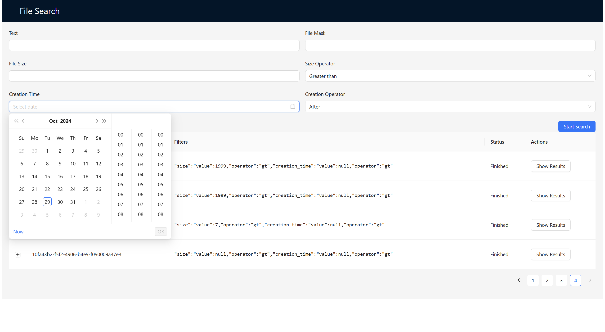
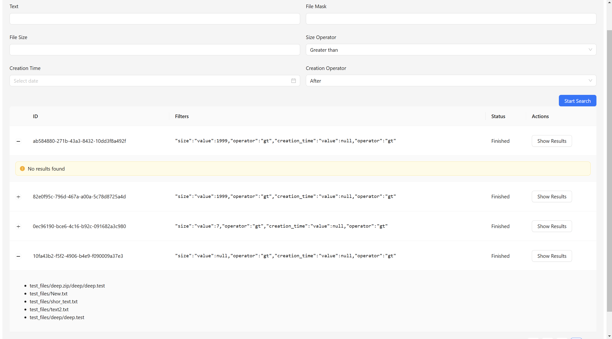
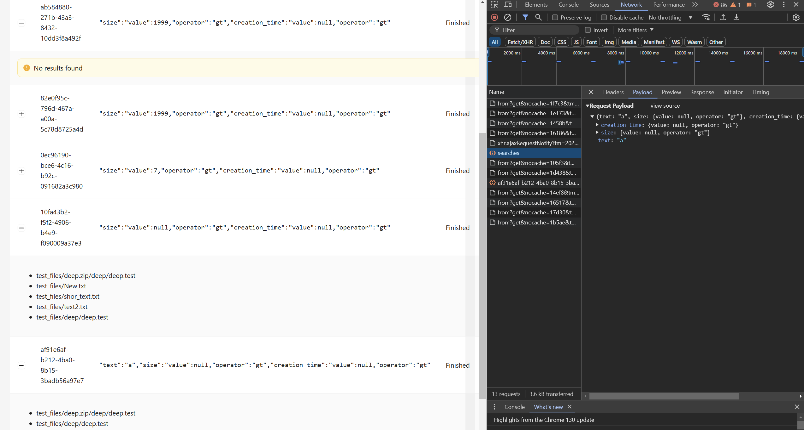

# file_search

## Как выглядит фронтенд

## На бэке сделал через Threads, можно было бы поднять celery и хранить ответ в redis, но это подольше

Ещё можно было бы добавить long poling или WS, но решил не усложнять
В принципе можно красивее архитектуру написать, сгруппировать по доменам и получше типы прописать, но опять таки на скорую руку делал
